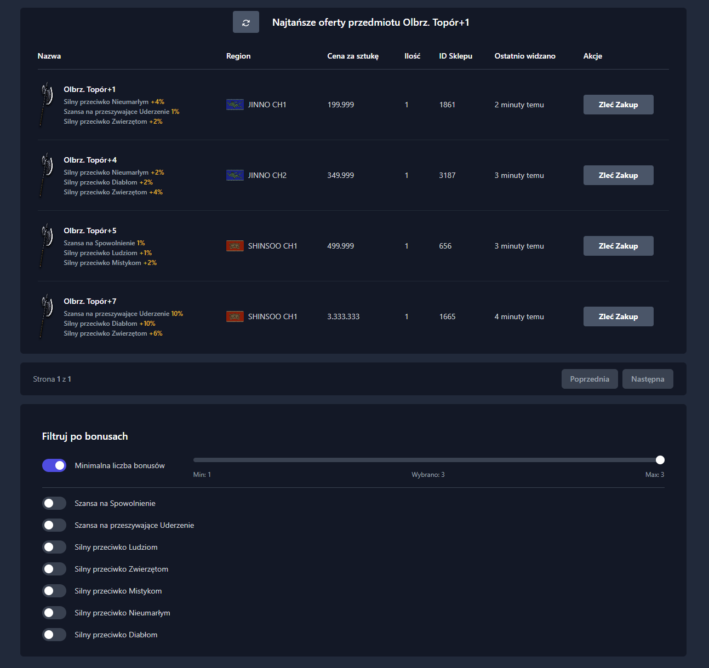
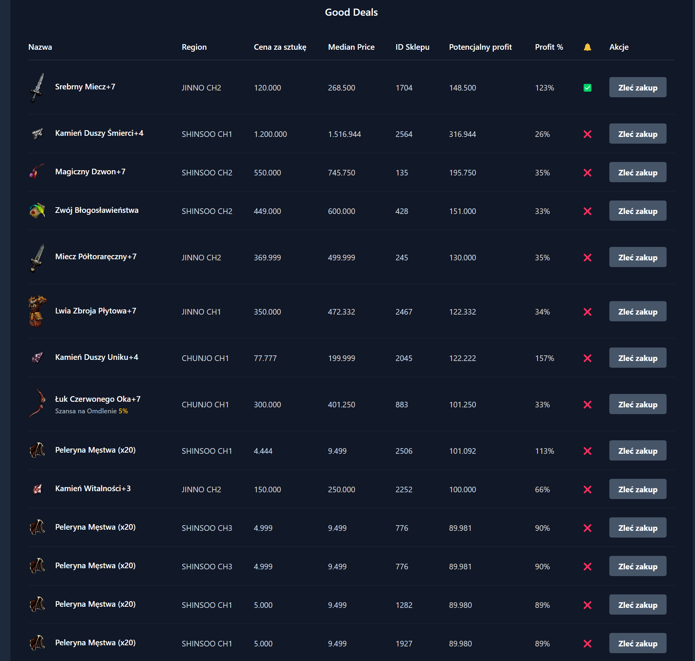
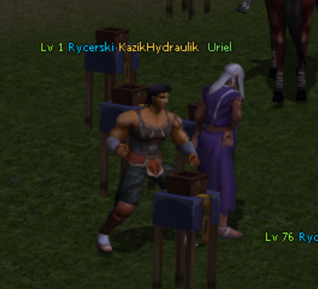

# Metin2 Clientless Bot

A fully functional clientless bot for Metin2 private servers, specifically designed for Metin2009 Polish server but adaptable to other private servers. This bot provides automated shop scanning, item purchasing, and database storage capabilities.

## ⚠️ Important Notice

**This project is provided as-is and will not be actively maintained.** The bot was fully working at the time of publication, but game updates may break functionality without corresponding updates to this codebase.

## 🎯 Features

- **Shop Scanning**: Automatically scans player shops across all regions
- **Item Database**: Stores scanned items in PostgreSQL database with full details
- **Automated Trading**: Supports buying items through database requests
- **Money Management**: Handles yang deposits, withdrawals, and fee collection
- **Proxy Support**: Built-in proxy configuration for connection routing
- **Transaction Fees**: Configurable fee system for bot operations

## 📊 Performance Stats

This bot has been battle-tested with impressive results:
- **Runtime**: 6 months of continuous operation
- **Scale**: 10 bots scanning 24/7 across all regions
- **Volume**: Processed **4,160,959,543 yang** worth of transactions

## 🔧 Prerequisites

- .NET Core runtime
- PostgreSQL database
- Metin2 server connection details
- **TEA Encryption Keys** (must be dumped manually - not provided)
- **Item Proto Data** (must be extracted manually - not provided)

## 🚀 Quick Start

### 1. Database Setup

Create a PostgreSQL database and run the provided schema (see Database Schema section below).

### 2. Environment Configuration

Create a `.env` file or set environment variables:

```env
# Server Configuration
GATEKEEPER_IP=81.21.4.132
SERVER_IP=81.21.4.132
SEND_SEQUENCE=false
LOGIN_PORT=11002
SELECT_PORT=13001
GAME_PORT=13801
CLIENT_VERSION=1010026

# Proxy Configuration
PROXY_ENABLED=false
PROXY_HOST=proxy.example.com
PROXY_PORT=8080
PROXY_USERNAME=username
PROXY_PASSWORD=password

# Account Details
ACCOUNT_USERNAME=BotAccount
ACCOUNT_PASSWORD=SecurePassword123
ACCOUNT_PIN=1234
ACCOUNT_REGION="CHUNJO CH1"
HWID_HASH=YOUR_HWID_HASH_HERE

# Shop Scanning Configuration
SHOP_ID_MODULO=1
SHOP_ID_EXPECTED_MODULO_VALUE=0

# Database
POSTGRES_CONNECTION_STRING="Host=localhost;Username=postgres;Password=password;Database=metin2bot"
```

### 3. Build and Run

```bash
dotnet build
dotnet run
```

## 📋 Environment Variables

| Variable                        | Description                           | Required | Example                                    |
|---------------------------------|---------------------------------------|----------|--------------------------------------------|
| `GATEKEEPER_IP`                 | IP address of the gatekeeper server   | Yes      | `81.21.4.132`                              |
| `SERVER_IP`                     | IP address of the game server         | Yes      | `81.21.4.132`                              |
| `SEND_SEQUENCE`                 | Whether to send sequence packets      | Yes      | `false`                                    |
| `LOGIN_PORT`                    | Port for login server                 | Yes      | `11002`                                    |
| `SELECT_PORT`                   | Port for character selection          | Yes      | `13001`                                    |
| `GAME_PORT`                     | Port for game server                  | Yes      | `13801`                                    |
| `CLIENT_VERSION`                | Client version number                 | Yes      | `1010026`                                  |
| `PROXY_ENABLED`                 | Enable proxy connection               | No       | `true`                                     |
| `PROXY_HOST`                    | Proxy server hostname                 | No*      | `proxy.example.com`                        |
| `PROXY_PORT`                    | Proxy server port                     | No*      | `8080`                                     |
| `PROXY_USERNAME`                | Proxy authentication username         | No*      | `username`                                 |
| `PROXY_PASSWORD`                | Proxy authentication password         | No*      | `password`                                 |
| `ACCOUNT_USERNAME`              | Game account username                 | Yes      | `BotAccount`                               |
| `ACCOUNT_PASSWORD`              | Game account password                 | Yes      | `SecurePassword123`                        |
| `ACCOUNT_PIN`                   | Account PIN/deletion password         | Yes      | `1234`                                     |
| `ACCOUNT_REGION`                | Starting region and channel           | Yes      | `"CHUNJO CH1"`                             |
| `HWID_HASH`                     | Hardware ID hash for authentication   | Yes      | `ABC123... (96 bytes (192 hex characters)` |
| `SHOP_ID_MODULO`                | Modulo value for shop filtering       | Yes      | `1`                                        |
| `SHOP_ID_EXPECTED_MODULO_VALUE` | Expected remainder for shop filtering | Yes      | `0`                                        |
| `POSTGRES_CONNECTION_STRING`    | PostgreSQL connection string          | Yes      | See example above                          |

*Required when `PROXY_ENABLED=true`

## 🔐 Security & Encryption

### TEA Encryption
This bot implements TEA (Tiny Encryption Algorithm) encryption as used by Metin2 servers. **Important notes:**

- **Encryption keys are NOT included** in this repository
- You must dump the encryption keys from your target server yourself
- Different servers may use different encryption methods based on compilation flags
- Early server versions used `IMPROVEDPACKET_ENCRYPTION_` flag with different logic
- Current implementation supports the standard TEA encryption used after initial server updates

### Missing Dependencies
You must obtain these yourself:
- **TEA Encryption/Decryption Keys**: Hook TEA methods in the game client to dump keys
- **HWID Hash**: Obtain your HWID hash from the game client by hooking recv and send methods or reverse how it's generated
- **Item Proto Data**: Required for item name/attribute mapping

## 📦 Packet Information

### Understanding Metin2 Packet Structure

To properly decrypt and parse Metin2 network packets, you need comprehensive information about **all** packet types, not just the ones your bot uses. This is because:

- Metin2 sends multiple packets joined together in a single network message
- Without knowing every packet's length, it's impossible to correctly separate and read individual packets
- Missing packet information will cause desynchronization and packet parsing failures

### Current Implementation

The bot includes a `PacketInfo` structure that maps packet headers to their sizes and properties:

```csharp
public struct PacketInfo(int size, bool isDynamicSize)
{
    public static readonly Dictionary<int, PacketInfo> Map = new Dictionary<int, PacketInfo>
    {
        { 90, new PacketInfo(2, false) },
        { 65, new PacketInfo(15, false) },
        { 73, new PacketInfo(2, false) },
        // ... over 100 packet definitions
    };
}
```

Packet Properties
Each packet definition includes:
- Header ID: Unique identifier for the packet type
- Size: Length of the packet in bytes
- IsDynamicSize: Whether the packet has variable length, if so the size is determined by the first two bytes of the packet after header

### ⚠️ Important Notes

- Packet sizes may change after server updates
- New packets may be added with game updates
- You must extract packet information from client files yourself
- The provided packet definitions are specific to Metin2009 server at the time of development

Packet information can be extracted from client binary files through reverse engineering client executables  
**Note**: The process of extracting packet information requires advanced reverse engineering skills and is beyond the scope of this documentation.

## 💾 Database Schema

The bot uses PostgreSQL with the following tables:

### Core Tables
- `bots`: Bot configuration and status tracking
- `bot_status`: Real-time bot status monitoring
- `items`: Scanned shop items with full details
- `players`: Player management and fee configuration

### Transaction Tables
- `shop_purchases`: Item purchase requests and status
- `money_transactions`: Yang deposit/withdrawal tracking
- `player_balance`: Player account balances
- `player_items`: Player inventory management

<details>
<summary>Click to view complete database schema</summary>

```sql
CREATE TABLE bot_status (
    nickname     VARCHAR(255)                        NOT NULL
        CONSTRAINT bot_status_8_pk PRIMARY KEY,
    region       VARCHAR(255)                        NOT NULL,
    last_seen_at TIMESTAMP DEFAULT CURRENT_TIMESTAMP NOT NULL
);

CREATE TABLE bots (
    id                      UUID      DEFAULT uuid_generate_v4() NOT NULL PRIMARY KEY,
    nickname                VARCHAR(255)                         NOT NULL UNIQUE,
    region                  VARCHAR(255)                         NOT NULL,
    available_shops         INTEGER[] DEFAULT ARRAY[]::INTEGER[],
    last_shop_received_at   TIMESTAMP DEFAULT CURRENT_TIMESTAMP  NOT NULL,
    last_packet_received_at TIMESTAMP DEFAULT CURRENT_TIMESTAMP  NOT NULL,
    pending_fees            INTEGER   DEFAULT 0                  NOT NULL
);

CREATE TABLE items (
    shop_id                INTEGER                              NOT NULL,
    item_id                INTEGER                              NOT NULL,
    pos                    SMALLINT                             NOT NULL,
    count                  INTEGER                              NOT NULL,
    yang                   BIGINT                               NOT NULL,
    wons                   BIGINT                               NOT NULL,
    total_price            BIGINT                               NOT NULL,
    region                 VARCHAR(255)                         NOT NULL,
    created_at             TIMESTAMP DEFAULT CURRENT_TIMESTAMP  NOT NULL,
    updated_at             TIMESTAMP DEFAULT CURRENT_TIMESTAMP  NOT NULL,
    shop_transaction_id    BIGINT                               NOT NULL,
    item_transaction_id    BIGINT                               NOT NULL,
    id                     UUID      DEFAULT uuid_generate_v4() NOT NULL PRIMARY KEY,
    attributes             JSONB     DEFAULT '{}'::JSONB,
    sockets                JSONB     DEFAULT '[]'::JSONB,
    has_built_in_attribute BOOLEAN   DEFAULT FALSE,
    CONSTRAINT items_shop_pos_region_unique UNIQUE (shop_id, pos, region)
);

CREATE TABLE money_transactions (
    id                 UUID               DEFAULT uuid_generate_v4()            NOT NULL PRIMARY KEY,
    bot_id             UUID                                                     NOT NULL
        REFERENCES bots ON DELETE CASCADE,
    player_name        VARCHAR                                                  NOT NULL,
    transaction_type   transaction_type                                         NOT NULL,
    transaction_status transaction_status DEFAULT 'PENDING'::transaction_status NOT NULL,
    amount             BIGINT                                                   NOT NULL
        CONSTRAINT money_transactions_amount_check CHECK (amount > 0),
    metadata           JSONB              DEFAULT '{}'::JSONB                   NOT NULL,
    created_at         TIMESTAMP          DEFAULT CURRENT_TIMESTAMP             NOT NULL,
    updated_at         TIMESTAMP          DEFAULT CURRENT_TIMESTAMP             NOT NULL,
    error_message      VARCHAR
);

CREATE TABLE player_balance (
    id          UUID      DEFAULT uuid_generate_v4() NOT NULL PRIMARY KEY,
    bot_id      UUID                                 NOT NULL
        REFERENCES bots ON DELETE CASCADE,
    player_name VARCHAR                              NOT NULL,
    balance     BIGINT    DEFAULT 0                  NOT NULL
        CONSTRAINT player_balance_balance_check CHECK (balance >= 0),
    created_at  TIMESTAMP DEFAULT CURRENT_TIMESTAMP  NOT NULL,
    updated_at  TIMESTAMP DEFAULT CURRENT_TIMESTAMP  NOT NULL,
    UNIQUE (bot_id, player_name)
);

CREATE TABLE player_items (
    id                 UUID      DEFAULT uuid_generate_v4() NOT NULL PRIMARY KEY,
    bot_id             UUID                                 NOT NULL
        REFERENCES bots ON DELETE CASCADE,
    player_name        VARCHAR                              NOT NULL,
    item_id            INTEGER                              NOT NULL,
    count              INTEGER                              NOT NULL,
    inventory_position INTEGER                              NOT NULL,
    withdrawn          BOOLEAN   DEFAULT FALSE              NOT NULL,
    created_at         TIMESTAMP DEFAULT CURRENT_TIMESTAMP  NOT NULL,
    updated_at         TIMESTAMP DEFAULT CURRENT_TIMESTAMP  NOT NULL
);

CREATE TABLE players (
    id                   UUID                     DEFAULT uuid_generate_v4() NOT NULL PRIMARY KEY,
    nickname             VARCHAR(255)                                        NOT NULL UNIQUE,
    fee_percentage       NUMERIC(5, 2)            DEFAULT 0                  NOT NULL
        CONSTRAINT players_fee_percentage_check CHECK (fee_percentage >= 0::NUMERIC),
    fee_cap              INTEGER                  DEFAULT 0                  NOT NULL
        CONSTRAINT players_fee_cap_check CHECK (fee_cap >= 0),
    total_fees_collected INTEGER                  DEFAULT 0                  NOT NULL,
    created_at           TIMESTAMP WITH TIME ZONE DEFAULT NOW()              NOT NULL,
    updated_at           TIMESTAMP WITH TIME ZONE DEFAULT NOW()              NOT NULL
);

CREATE TABLE shop_purchases (
    id                  UUID               DEFAULT uuid_generate_v4()              NOT NULL PRIMARY KEY,
    bot_id              UUID                                                       NOT NULL
        REFERENCES bots ON DELETE CASCADE,
    player_name         VARCHAR                                                    NOT NULL,
    shop_id             INTEGER                                                    NOT NULL,
    item_id             INTEGER                                                    NOT NULL,
    count               INTEGER                                                    NOT NULL
        CONSTRAINT shop_purchases_count_check CHECK (count > 0),
    price               BIGINT                                                     NOT NULL
        CONSTRAINT shop_purchases_price_check CHECK (price >= 0),
    transaction_status  transaction_status DEFAULT 'REQUESTED'::transaction_status NOT NULL,
    metadata            JSONB              DEFAULT '{}'::JSONB                     NOT NULL,
    created_at          TIMESTAMP          DEFAULT CURRENT_TIMESTAMP               NOT NULL,
    updated_at          TIMESTAMP          DEFAULT CURRENT_TIMESTAMP               NOT NULL,
    error_message       VARCHAR,
    shop_transaction_id BIGINT                                                     NOT NULL,
    item_transaction_id BIGINT                                                     NOT NULL,
    fees_collected      BIGINT             DEFAULT 0                               NOT NULL
        CONSTRAINT shop_purchases_fees_collected_check CHECK (fees_collected >= 0),
    money_taken         BOOLEAN            DEFAULT FALSE                           NOT NULL
);
```
</details>

## 🎮 Bot Interaction

### Allowed Users
Configure `TradeAllowedCharacters` in the configuration to specify which player nicknames can interact with the bot.

### Interaction Methods
- **Message the bot**: Temporarily stops shop scanning for interaction
- **Add to friends**: Also pauses scanning to allow trade interaction
- **Trade interaction**: Bot will pause scanning during active trades

### Money Management
- **Deposit**: Give yang to the bot in trade - amount is stored in database
- **Withdraw**: Give exactly **1 yang** to the bot in trade to withdraw your full balance

### Item Purchasing
1. Insert a new row into the `shop_purchases` table with desired item details
2. Bot will automatically fulfill the request if the item is still available
3. Items are delivered during trade interactions

### Fee System
- Configurable transaction fees per player
- Fees are automatically calculated and retained by the bot
- Fee structure supports both percentage and cap limits

## 🗂️ Project Structure

```
MetinClientless/
├── Configuration.cs          # Application configuration
├── DatabaseService.cs        # Database operations
├── GameState.cs             # Game state management
├── PacketHandlerRegistry.cs # Packet processing registry
├── Program.cs               # Application entry point
├── SequenceTable.cs         # Sequence handling
├── SocketHandler.cs         # Network communication
├── SqlQueryBuilder.cs       # SQL query construction
├── Encryption/              # TEA encryption implementation
├── Handlers/                # Game packet handlers
├── Items/                   # Item management
├── Packets/                 # Packet definitions
├── Services/                # Application services
└── Errors/                  # Error handling
```

## ⚖️ Legal Disclaimer

This software is provided for educational purposes only. Users are responsible for:
- Complying with the terms of service of any game servers they connect to
- Ensuring their use complies with local laws and regulations
- Understanding that automated gameplay may violate game terms of service

## 🤝 Contributing

This project is no longer actively maintained. However, you may fork it and adapt it for your own needs.

## 🗿 Credits

- [KoMaR1911](https://github.com/KoMaR1911) - Special thanks for invaluable assistance with client unpacking, reverse engineering, providing HWID spoofer, and numerous other technical contributions that made this project possible.

## 🖼️ Showcase

**Note**: The web management interface is not included in this repository and will remain proprietary.






---

**Note**: This bot represents weeks of development and testing. While it was stable during its operational period, game updates or server changes may require code modifications to maintain functionality.